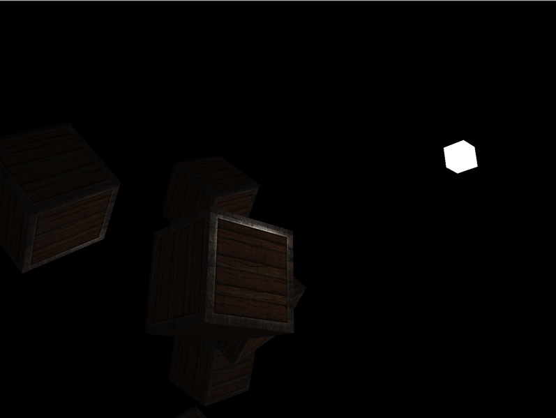

# OpenGL
Exploring computer graphics through OpenGL

Current project features:

* GLFW window library to handle window events.
* Adding textures
* Camera movement using mouse
* Camera movement using keyboard
* Diffuse lighting 
* Ambient lighting 
* Specular lighting 
* Easy shader loading with Shader class

